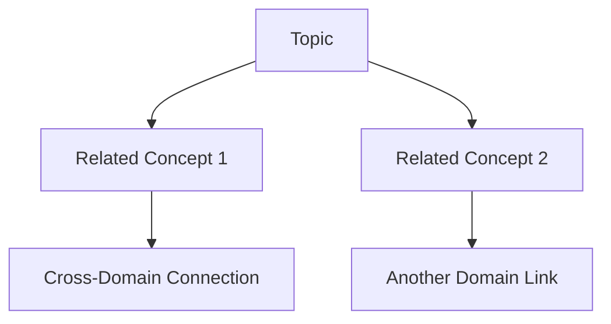

# Recursive Exploration Skill

A skill for deep, iterative investigation of topics using RLM-inspired recursive refinement patterns. This skill systematically explores context space across your vault, internet sources, and codebase to build comprehensive understanding through multi-stage discovery, mapping, and refinement cycles.

## Argument Parsing

Parse `$ARGUMENTS` to determine operation:
- `[operation]` — One of: `deep-explore`, `trace-connections`, `refine-answer`, `map-context`
- `[target]` — The topic/subject/question to investigate (required)

### Supported Operations

| Operation | Description | Default Depth |
|-----------|-------------|---------------|
| **deep-explore** | Full recursive investigation with reasoning trace across all sources | Auto-detected |
| **trace-connections** | Map relationships between concepts and find cross-domain links | 3-4 iterations |
| **refine-answer** | Iteratively improve answer quality using self-critique loops | 3 iterations |
| **map-context** | Build comprehensive knowledge map of a domain with key concepts and gaps | Auto-detected |

## Usage Examples

### Full Recursive Exploration
```bash
/recursive-exploration deep-explore recursive learning models --depth 7
```
Conducts deep investigation into the topic, exploring your vault files, web sources, and codebase to build comprehensive understanding through multiple refinement cycles.

### Trace Concept Connections  
```bash
/recursive-exploration trace-connections category theory in programming languages
```
Discovers relationships between concepts, identifies cross-domain connections, and maps how ideas interlink across different knowledge areas.

### Refine Answer with Self-Critique
```bash
/recursive-exploration refine-answer what is the relationship between lora and transformers
```
Runs iterative self-critique loops to improve answer quality, explicitly tracing reasoning steps with [[REASONING]] markers showing intermediate thought processes.

### Map Domain Context Space
```bash
/recursive-exploration map-context neural architecture search --sources=vault,web
```
Builds a comprehensive knowledge map of the domain, identifying key concepts, their relationships, and any gaps in coverage.

## How It Works (RLM-Inspired)

This skill applies Recursive Learning Models principles from RML methodology:

### 1. PRefLexOR-Style Feedback Loops
Each exploration follows an iterative refinement pattern:
```
Initial Analysis → Self-Critique → Refinement → Re-evaluation → Final Output
```
The skill continuously improves its understanding through explicit feedback cycles, similar to preference-based recursive language modeling.

### 2. Thinking Tokens Framework
All reasoning steps are explicitly marked with `[[REASONING]]` markers for traceability:
- `[[REASONING]] Phase 1: Discovery - finding all relevant content`
- `[[REASONING]] Phase 2: Mapping - identifying connections between concepts`  
- `[[REASONING]] Phase 3: Deep Dive - systematic exploration of high-value areas`

### 3. Graph-PReFLexOR Knowledge Expansion
Concepts are explored as interconnected nodes, building knowledge graphs that show relationships:


### 4. Mixture-of-Recursions Adaptive Depth
The skill dynamically adjusts exploration depth based on:
- Initial connection count (more connections = deeper exploration)
- Source diversity (multiple source types increase complexity)
- Query ambiguity (vague queries get more iterations for clarification)
- Domain breadth (broad topics trigger variable scaling rule: 5 + connections/10, capped at 12)

## Process Overview

### Discovery Phase (Deterministic)
Uses Glob/Grep/Bash to exhaustively find all relevant content across sources. No filtering - everything that matches is collected for analysis.

### Mapping Phase (Mixed)
Builds relationship graph from discovered content:
- **Deterministic**: Cross-reference detection via pattern matching
- **LLM-based**: Infer conceptual links and semantic relationships

### Deep Dive Phase (Non-Deterministic)
Selective exploration of high-value areas using Task sub-agents for complex reasoning. Focuses on:
- Conceptual depth in core topics
- Cross-domain connections that reveal insights
- Edge cases and alternative viewpoints

### Synthesis & Refinement (Iterative)
Combines findings into coherent output through multiple cycles:
1. Generate initial synthesis
2. Self-critique for completeness and accuracy  
3. Refine based on critique
4. Repeat until convergence or max iterations reached

## Source Integration

The skill searches across three primary sources in priority order:

### 1. Obsidian Vault (if specified)
- Uses Glob to find `.md` files matching topic keywords
- Grep for cross-references, links, and related concepts
- Reads full content for deep analysis

### 2. Codebase (current directory / project)  
- Finds relevant source files via pattern matching
- Extracts documentation and comments
- Identifies implementation patterns

### 3. Internet Sources (WebFetch)
- Generates targeted queries based on topic analysis
- Fetches and synthesizes information from authoritative sources
- Cross-references with local findings for verification

## Convergence Detection

The skill automatically detects when further refinement yields diminishing returns:
- **Convergence threshold**: <15% improvement score across 2 consecutive iterations
- **Quality gates before final output**: Multiple sources confirm, alternatives considered, edge cases documented
- **Max retry logic**: Tries 3 different strategies before giving up

## Output Format

### Reasoning Blocks (Explicit Intermediate Steps)
```
[[REASONING]] Phase 1: Discovery
Searching vault for files matching "recursive learning"...
Found 3 relevant markdown files in knowledge base...

[[REASONING]] Phase 2: Mapping  
Identifying connections between concepts...
- RET-LLM connects to PRefLexOR via memory framework lineage
- Graph-PReFLexOR extends PRefLexOR with symbolic abstraction
```

### Final Answer Sections
1. **Executive Summary**: High-level overview of findings
2. **Key Findings**: Structured bullet points with evidence
3. **Concept Map**: Visual representation of relationships (when applicable)
4. **Gaps & Questions**: Areas needing further investigation
5. **References**: Sources used for this exploration

## Error Handling Strategy

When exploration fails or returns partial results:

1. **Retry with alternative sources** - If vault search fails, try web sources
2. **Switch traversal strategies** - Breadth-first → Depth-first → Targeted
3. **Expand context** - Search related terms and broader domain if stuck
4. **Report partial findings** - After max retries (3), provide best answer with specific suggestions for human follow-up

## Reference Files

- `references/exploration-patterns.md` — RLM iterative refinement patterns
- `references/context-traversal.md` — Discovery → Mapping → Deep Dive methodology  
- `references/convergence-checks.md` — Stopping criteria and quality gates

## Scripts

- `scripts/explore.py` — Core exploration engine with Click CLI
- `scripts/refine.py` — Self-critique loop and convergence detection

---
name: scripts
---

# Python CLI Scripts for Recursive Exploration

Deterministic logic for content discovery, traversal strategy selection, and refinement operations. These scripts handle reproducible tasks while delegating reasoning to the LLM via Task tool invocations.

## File Overview

### explore.py
Core exploration engine that orchestrates discovery across sources (vault, codebase, web) with Click-based CLI interface. Handles argument parsing, complexity detection, and strategy rotation on failure.

### refine.py  
Self-critique loop implementation with convergence detection. Evaluates output quality improvements across iterations and switches strategies when stuck.

## Script Invocation

Scripts are invoked via the main SKILL.md which calls them through Bash tool execution:
```bash
dotnet run scripts/explore.cs -- deep-explore <topic>
```

See SKILL.md for full usage documentation.

---
name: references
---

# Reference Files for Recursive Exploration Skill

Supporting documentation that provides detailed methodology, patterns, and guidelines read on-demand during skill execution. These files contain comprehensive reference material organized into logical sections for efficient loading.

## File Overview

### exploration-patterns.md
RLM-inspired iterative refinement methodologies including PRefLexOR feedback loops, thinking tokens framework with [[REASONING]] markers, rejection sampling quality gates, and graph-based knowledge expansion techniques.

### context-traversal.md  
Systematic exploration methodology covering three-phase approach (Discovery → Mapping → Deep Dive), traversal strategy selection guide, and source integration patterns for vault/codebase/web sources.

### convergence-checks.md
Stopping criteria documentation including convergence detection algorithms (<15% improvement threshold), quality gate checklists before final output, and escalation criteria when skill cannot converge after maximum retries.

## Usage Pattern

Main SKILL.md orchestrates exploration by reading these reference files as needed:
```python
# In explore.py or refine.py scripts
from manage_skill import read_reference_file

patterns = read_reference_file("exploration-patterns.md")
traversal_guide = read_reference_file("context-traversal.md")
convergence_rules = read_reference_file("convergence-checks.md")
```

This keeps SKILL.md focused on orchestration while reference files contain detailed content.
