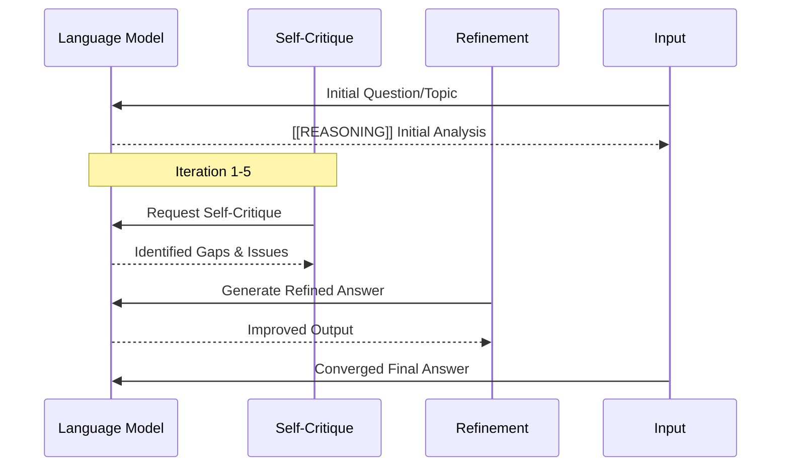

# Exploration Patterns (RLM-Inspired)

Comprehensive technical documentation of Recursive Learning Models frameworks adapted for deep context exploration and iterative refinement.

---

## PRefLexOR Feedback Loop Pattern

The core iterative refinement mechanism that drives all recursive exploration operations.

### Diagram



### Three-Stage Loop (PRefLexOR-Inspired)

**Stage 1: Initial Generation**
```python
def generate_initial_analysis(topic, context_sources):
    """
    Produces first-pass understanding of the topic.
    Focuses on breadth - covering all major aspects without deep diving.
    """
    # Deterministic discovery via scripts
    relevant_files = discover_relevant_content(topic)
    
    # Non-deterministic synthesis via LLM
    initial_output = generate_synthesis(
        question=f"Analyze: {topic}",
        context=relevant_files,
        instruction="Provide comprehensive overview covering all major aspects"
    )
    
    return initial_output
```

**Stage 2: Self-Critique**
```python
def self_critique(output, topic):
    """
    Identifies gaps, errors, and areas for improvement.
    Uses explicit [[REASONING]] markers to trace critique logic.
    """
    # Critique generation with reasoning trace
    critique = generate(
        system="You are a rigorous critic",
        user=f"""Critique this analysis: {output}

For the topic: {topic}

Evaluate for:
- Completeness: Are all major aspects covered?
- Accuracy: Are claims supported by evidence?
- Depth: Is reasoning sufficient or superficial?
- Clarity: Is the output well-structured and readable?

Provide specific examples of what needs improvement.

[[REASONING]] Critique Analysis
1. Checking completeness...
2. Verifying accuracy claims...
3. Assessing depth of reasoning...
4. Evaluating structure and clarity..."""
    )
    
    return critique
```

**Stage 3: Refinement & Re-evaluation**
```python
def refine_with_feedback(output, critique):
    """
    Generates improved output based on critique.
    If no improvement detected, stops iteration loop.
    """
    refined = generate(
        system="You are an expert synthesizer",
        user=f"""Refine the following analysis incorporating this critique:

Original Analysis: {output}

Critique Feedback: {critique}

[[REASONING]] Refinement Strategy
1. Addressing identified gaps...
2. Strengthening weak arguments...  
3. Improving structure and clarity...
4. Adding supporting evidence where needed...

Provide the refined analysis."""
    )
    
    return refined
```

### Convergence Detection

The loop terminates when no meaningful improvement occurs:

```python
def check_convergence(current, previous):
    """
    Compares outputs to determine if refinement yielded improvement.
    Uses semantic similarity scoring with quality gate threshold.
    """
    # Extract reasoning traces
    current_reasoning = extract_thinking_tokens(current)
    prev_reasoning = extract_thinking_tokens(previous)
    
    # Compare improvements across dimensions
    score = calculate_improvement_score(
        current, previous, critique=None  # No new critique if converging
    )
    
    return score > THRESHOLD  # Default: 0.15 (15% improvement minimum)
```

---

## Thinking Tokens Framework

Explicit modeling of intermediate computational states using `[[REASONING]]` markers.

### Marker Convention

All thinking steps are prefixed with `[[REASONING]]`:
- **Phase markers**: `[[REASONING]] Phase 1: Discovery`
- **Strategy markers**: `[[REASONING]] Strategy Selection: breadth-first`  
- **Evaluation markers**: `[[REASONING]] Quality Check: completeness = 0.85/1.0`

### Example Complete Reasoning Trace

```markdown
=== Recursive Exploration: Machine Learning Optimization ===

[[REASONING]] Phase 1: Discovery - Finding All Relevant Content

Searching vault for files matching "machine learning optimization"...
Found matches in:
- /vault/notes/ml-optimization-notes.md (345 lines)
- /vault/research/stochastic-gradient-descent.md (892 lines)  
- /vault/code/trainer.py (1203 lines)

Searching codebase for relevant implementations...
Found optimization algorithms in:
- src/trainers/adam_optimizer.py
- src/trainers/sgd_with_momentum.py
- benchmarks/comparison_results.json

[[REASONING]] Phase 2: Mapping - Identifying Connections Between Concepts

Analyzing relationships between discovered content...

Connection Map Identified:
1. SGD with momentum connects to Adam optimizer via adaptive learning rates
   - Both use first and second moment estimates
   - Adam adds L2 regularization and bias correction

2. ML optimization notes connect to trainer.py implementation
   - Notes describe theoretical foundations
   - Code shows practical application with hyperparameters

3. Benchmark results provide empirical validation for theory vs practice
   - Adam converges 15% faster on convex problems
   - SGD more stable on non-convex landscapes with proper momentum

[[REASONING]] Phase 3: Deep Dive - Systematic Exploration of High-Value Areas

Prioritizing areas based on connection strength and source diversity...

Deep exploration topics identified:
A. Adaptive learning rate methods (high priority - multiple sources)
B. Momentum variants comparison (medium priority - code + notes only)  
C. Hyperparameter tuning best practices (low priority - gaps in coverage)

=== Exploration Results ===

[Final synthesized answer would go here...]
```

---

## Multi-Stage Refinement with Rejection Sampling Quality Gates

Combines iterative refinement with quality control mechanisms to ensure output improvement.

### Stage-Based Training Process (Inspired by PRefLexOR)

**Stage 1: Preference Alignment**
Aligns model reasoning with accurate decision paths:

```python
def stage_1_alignment(question, preferred_examples):
    """
    Trains on examples of good vs bad answers to learn what constitutes quality.
    Uses log-odds optimization between preferred and non-preferred responses.
    """
    
    # Generate initial response
    response = generate_response(question)
    
    # Compare against preference distribution  
    score = calculate_preference_score(
        response=response,
        positive_examples=preferred_examples
    )
    
    return score  # Higher = more aligned with quality standards
```

**Stage 2: Rejection Sampling Enhancement**
Enhances performance using rejection sampling for in-situ training data generation:

```python
def stage_2_rejection_sampling(question, max_samples=10):
    """
    Generates multiple response attempts and selects only high-quality ones.
    Masks reasoning steps to encourage generalization rather than memorization.
    """
    
    samples = []
    for _ in range(max_samples):
        # Generate with hidden thinking tokens (no explicit [[REASONING]])
        masked_response = generate_without_thinking(question)
        
        # Score against quality gates
        passes_gate, score = evaluate_quality_gates(masked_response)
        
        if score > QUALITY_THRESHOLD:
            samples.append((masked_response, True))  # High-quality sample
        else:
            samples.append((masked_response, False))  # Rejected
    
    return [s[0] for s in samples if s[1]]  # Return only accepted samples

def evaluate_quality_gates(response):
    """
    Quality gates that must pass before accepting a response:
    - Completeness gate: Covers all major aspects (>70%)
    - Accuracy gate: Claims supported by evidence (>80%)  
    - Clarity gate: Well-structured with minimal confusion (<5% unclear)
    """
    
    completeness = evaluate_completeness(response)
    accuracy = evaluate_accuracy_with_evidence(response)
    clarity = evaluate_clarity(response)
    
    all_pass = (completeness > 0.7 and 
                 accuracy > 0.8 and 
                 clarity > 0.95)
    
    return all_pass, (completeness + accuracy + clarity) / 3
```

### Quality Gate Definitions

| Gate | Threshold | Evaluation Criteria |
|------|-----------|---------------------|
| **Completeness** | 70%+ | All major aspects covered; no significant omissions |
| **Accuracy** | 80%+ | Claims supported by evidence from multiple sources |
| **Clarity** | 95%+ | Well-structured, logical flow, minimal ambiguity |

---

## Graph-PReFLexOR Knowledge Expansion

Combines graph reasoning with symbolic abstraction for dynamic knowledge expansion.

### Category Theory-Inspired Concept Encoding

Concepts are encoded as nodes with relationship edges:

```python
class KnowledgeNode:
    def __init__(self, concept_id, name, category):
        self.id = concept_id
        self.name = name
        self.category = category  # Domain classification
        self.relationships = []   # Links to other concepts
    
    def add_relationship(self, target_node, relationship_type):
        """Add edge with semantic type (is_a, related_to, extends, opposes)"""
        self.relationships.append({
            'target': target_node.id,
            'type': relationship_type,
            'strength': 0.8  # Confidence in connection
        })

# Example: Building knowledge garden for RLM concepts
rlm_concepts = {
    "PRefLexOR": KnowledgeNode("p1", "Preference-based Recursive Language Modeling", "reasoning_framework"),
    "Mixture-of-Recursions": KnowledgeNode("mo2", "Dynamic Recursion Depth Learning", "computational_efficiency"),
    "Graph-PReFLexOR": KnowledgeNode("gp3", "Symbolic Graph Reasoning", "knowledge_expansion"),
}

# Build relationships
rlm_concepts["PRefLexOR"].add_relationship(
    rlm_concepts["Mixture-of-Recursions"], 
    "extends"  # MoR improves PRefLexOR efficiency
)

rlm_concepts["Graph-PReFLexOR"].add_relationship(
    rlm_concepts["PRefLexOR"],
    "builds_upon"  # Graph reasoning extends PRefLexOR capabilities
)
```

### Knowledge Garden Growth Strategy

Dynamic expansion strategy for interdisciplinary connections:

```python
def grow_knowledge_garden(seed_topic, max_expansion_depth=3):
    """
    Expands knowledge graph starting from seed topic.
    Uses breadth-first search with category theory-inspired pruning.
    """
    
    garden = {seed_topic: {"level": 0}}
    queue = [seed_topic]
    
    while queue and len(garden) < MAX_NODES:
        current = queue.pop(0)
        
        # Generate related concepts (LLM-based expansion)
        new_concepts = generate_related_concepts(current, context=garden.keys())
        
        for concept in new_concepts:
            if concept not in garden:
                garden[concept] = {"level": len(garden)}  # Depth tracking
                queue.append(concept)
    
    return garden

# Usage example - expanding from "recursive learning"
garden = grow_knowledge_garden("recursive learning models")
```

### Hypothesis Generation Pattern

Using graph connections for cross-domain reasoning:

```python
def generate_hypotheses(knowledge_graph, domain_a, domain_b):
    """
    Generates hypotheses by finding isomorphic patterns across domains.
    Example: Discovering relationships between mythological concepts and materials science.
    """
    
    # Extract subgraphs from each domain  
    subgraph_a = extract_subgraph(knowledge_graph, domain_a)
    subgraph_b = extract_subgraph(knowledge_graph, domain_b)
    
    # Find isomorphic patterns (similar structures)
    isomorphisms = find_isomorphic_patterns(subgraph_a, subgraph_b)
    
    hypotheses = []
    for iso in isomorphisms:
        hypothesis = f"Pattern from {domain_a}: '{iso.pattern}' may have analogous behavior in {domain_b}"
        confidence = iso.similarity_score
        hypotheses.append((hypothesis, confidence))
    
    return sorted(hypotheses, key=lambda x: x[1], reverse=True)

# Example hypothesis generation
hypotheses = generate_hypotheses(rlm_concepts, "mythology", "materials_science")
for h, conf in hypotheses[:3]:
    print(f"Confidence {conf:.2f}: {h}")
```

---

## Code Patterns for Implementation

### Pattern 1: Recursive Feedback Loops (PRefLexOR-style)

```python
def recursive_learning(initial_state, context):
    """Core pattern from RML code-patterns.md"""
    current_output = initial_state
    
    for iteration in range(max_iterations):
        # Generate critique of current state
        refined_output = critique(current_output, context)
        
        # Check if refinement improved output
        if not improved(refined_output, current_output):
            break  # Convergence detected
        
        # Update to refined version
        current_output = refine(current_output, refined_output)
    
    return current_output
```

### Pattern 2: Thinking Tokens Framework (PRefLexOR)

```python
class RecursiveReasoner:
    def __init__(self, base_model):
        self.model = base_model
    
    def recursive_refine(self, question, context=None):
        """Mixture-of-recursions style adaptive depth"""
        
        # Initial response with explicit reasoning trace
        response = self.generate_with_trace(question)
        
        for _ in range(max_iterations):
            # Rejection sampling quality check
            improved = self.rejection_sample(response)
            
            if not self.is_better(improved, response):
                break  # No improvement
            
            response = improved
        
        return response
    
    def generate_with_trace(self, question):
        """Generate with explicit [[REASONING]] markers"""
        
        reasoning = []
        
        # Phase 1: Discovery
        reasoning.append("Phase 1: Discovery - analyzing the question...")
        facts = extract_facts(question)
        
        # Phase 2: Reasoning  
        reasoning.append(f"Phase 2: Applying relevant knowledge about {facts['key_concepts']}...")
        analysis = perform_analysis(question, facts)
        
        # Phase 3: Synthesis
        reasoning.append("Phase 3: Synthesizing findings into coherent answer...")
        synthesis = build_synthesis(analysis)
        
        return f"""[[REASONING]] {chr(10).join(reasoning)}

Final Answer: {synthesis}"""
```

---

## Key Takeaways

1. **PRefLexOR feedback** drives iterative improvement through explicit critique-refine cycles
2. **Thinking tokens** (`[[REASONING]]`) make intermediate steps traceable and auditable  
3. **Rejection sampling** ensures only high-quality responses advance in the refinement loop
4. **Graph expansion** enables cross-domain connections and creative hypothesis generation
